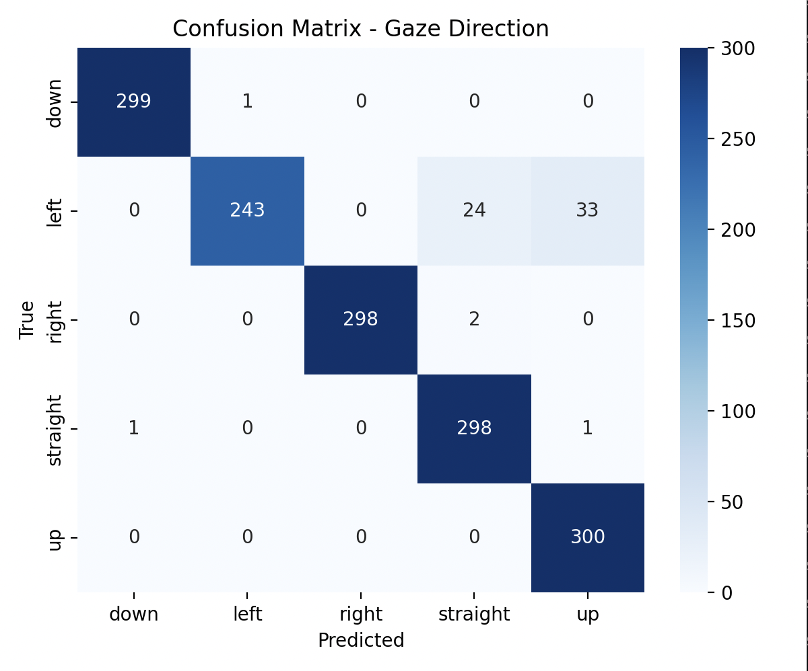
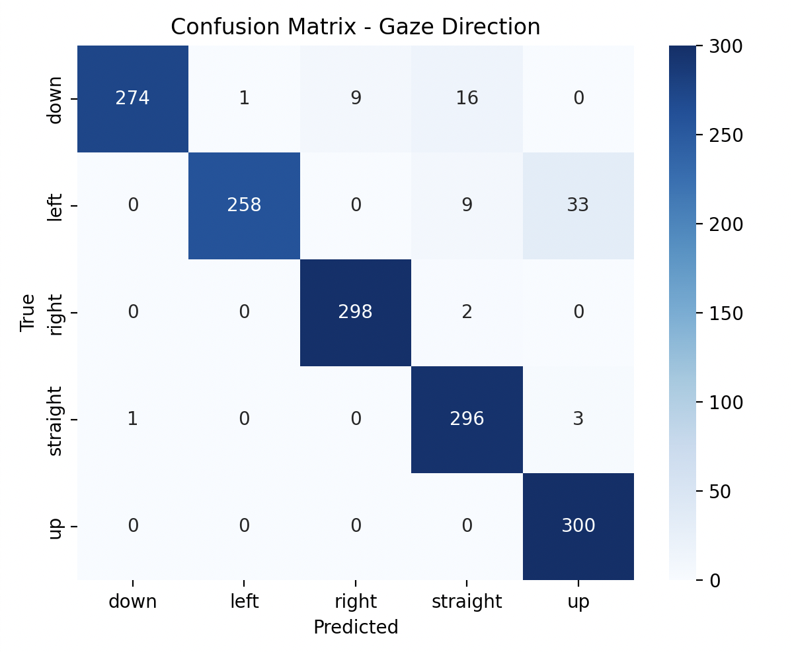

# Gaze Tracker

<video src="./assets/demo.mov" width="600" controls autoplay loop muted></video>

## Overview
This repository provides a gaze direction tracker that can detect five gaze directions: `up`, `down`, `left`, `right`, and `straight`. You can either use the pretrained models provided, train your own models, or run the gaze tracker directly using the pretrained weights.


## Pretrained Models
You can download the pretrained models from the `pretrained_models` folder. The models achieve high accuracy on the test dataset:  

| gaze_model.keras | 96% accuracy |


| gaze_model_qat_int8.tflite | 97% accuracy |
> be careful when using this modelit is indeed in int8 weights but uses float32 input/output




## Training
If you prefer to train yourself, make sure you have installed the requirements in train/requirements.txt, python 3.9 and the dataset divided in the 5 folders in the data folder:

- training:

```bash
# Basic training with default parameters
python src/main.py --data-dir path/to/dataset

```
```bash
# Training with custom batch size and number of epochs
python src/main.py --data-dir path/to/dataset --batch 64 --epochs 30

```
```bash
# Training and saving model to a custom path
python src/main.py --data-dir path/to/dataset --save-path models/my_model.keras

```

- quantizing:

```bash
#full command with batch, epochs, custom save path, and QAT
python src/main.py --data-dir path/to/dataset --batch 32 --epochs 25 --save-path models/gaze_model.keras --qat --qat-output models/gaze_model_qat_int8.tflite

```
## Run gaze-tracker
