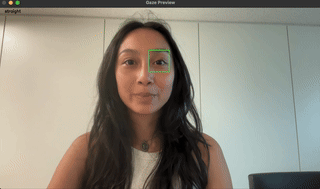

# Gaze Tracker



## Overview
This repository provides a gaze direction tracker that can detect five gaze directions: `up`, `down`, `left`, `right`, and `straight` and `blinking` state and `closed`state. You can use the provided pretrained models for gaze direction only, train your own models, or run the gaze tracker example that tracks all the eye states mentioned above, with an optional tracking mechanism that locks on the first detected person even if people are around or he leaves and comes back later or people trying to replace him.


## Use gaze-tracker
> Make sure you have the gaze model and a tracking model that I found from [sirius_ai's MobileFaceNet_TF](https://github.com/sirius-ai/MobileFaceNet_TF) in a same folder

- Then clone the repository:
```bash
git clone https://github.com/mailittlepony/gaze_tracker
```

- Make sure you have the requirements:
```bash
python -m venv venv
source venv/bin/activate
pip install -r requirements.txt
```

- Then you can import the module in your project like this:
```bash
from gaze_tracker import GazeTracker
```

- You can enable the tracking to the first person:
```bash
tracker = GazeTracker(enable_tracking=True, model_dir="model_folder_dir") # or to False if you want it to switch to whoever is detected first
```

- You can use it headless with:
```bash
state = tracker.get_eye_state(frame)
print("Eye state:", state)
```

- Or draw a preview:
```bash
frame = tracker.draw_preview(frame, state)
```

- Or run the example/demo:
```bash
python demo.py
```
you should have something like this:


## Pretrained Models
You can download the pretrained models from the `pretrained_models` folder. The models achieve high accuracy on the test dataset:  

| gaze_model.keras | 96% accuracy |


| gaze_model_qat_int8.tflite | 97% accuracy |
> Note: The int8 model uses float32 input/output despite the int8 weights.


## Training
If you prefer to train yourself, make sure you have installed the requirements in train/requirements.txt, python 3.9 and the dataset divided in the 5 folders in the data folder ([here](https://data.mendeley.com/datasets/vy4n28334m/1) the dataset I used):

- training:

```bash
# Basic training with default parameters
python train/main.py --data-dir path/to/dataset

```
```bash
# Training with custom batch size and number of epochs
python train/main.py --data-dir path/to/dataset --batch 64 --epochs 30

```
```bash
# Training and saving model to a custom path
python train/main.py --data-dir path/to/dataset --save-path models/my_model.keras

```

- quantizing:

```bash
#full command with batch, epochs, custom save path, and QAT
python train/main.py --data-dir path/to/dataset --batch 32 --epochs 25 --save-path models/gaze_model.keras --qat --qat-output models/gaze_model_qat_int8.tflite

```

